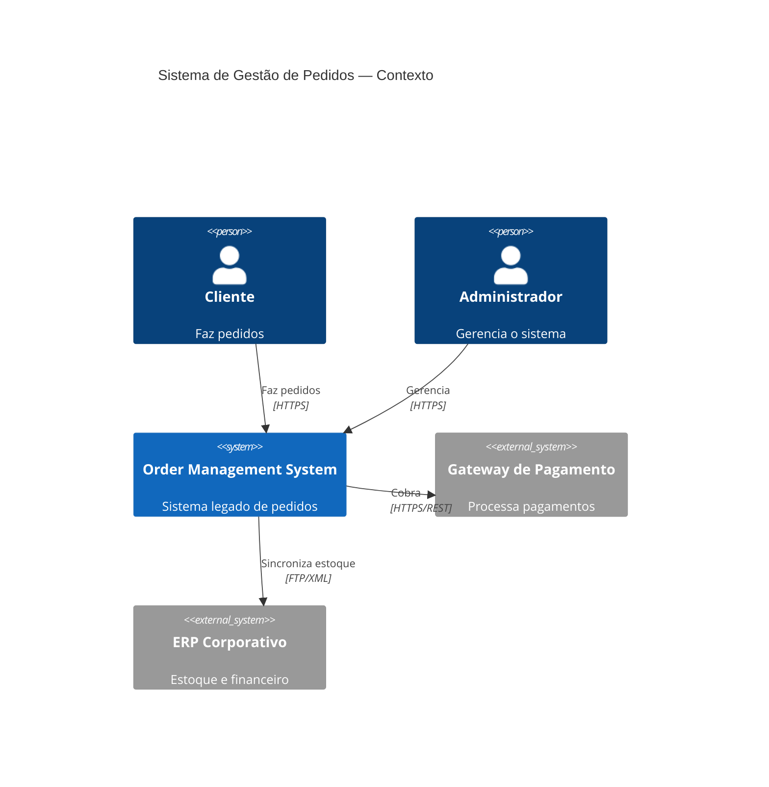

# Case 2: Analisador de Aplicações Legadas

> Módulo 03 · Case Prático 2 · Tempo estimado: 2h
> Stack: Node.js + TypeScript + Claude API + PlantUML/Mermaid
> Nível: Avançado

---

## O que é Este Case

Um sistema que **analisa repositórios de código legado** e gera documentação automática:

1. **Análise de Código:** lê o repositório e extrai serviços, use cases, entidades e dependências
2. **Documentação:** gera:
   - Diagrama C4 (Context, Container, Component) em Mermaid/PlantUML
   - Mapa de Contextos DDD (Bounded Contexts e seus relacionamentos)
   - Catálogo de Use Cases (lista de operações com entradas/saídas)
   - Relatório de Arquitetura (estilo, padrões encontrados, débitos técnicos detectados)

---

## O Problema Real

Aplicações legadas acumulam anos de desenvolvimento sem documentação.
Novos desenvolvedores levam semanas para entender o sistema.
Arquitetos não sabem o impacto de mudanças.

O Legacy Analyzer extrai esse conhecimento automaticamente do código.

---

## Resultado Esperado

```bash
npx legacy-analyzer analyze \
  --repo ./minha-aplicacao-legada \
  --output ./docs/architecture

# Saída:
# Analisando repositório... (lendo 247 arquivos)
# Identificando serviços... (encontrou 12 serviços)
# Gerando diagrama C4... ✓
# Mapeando Bounded Contexts... ✓
# Catalogando use cases... (42 encontrados)
# Gerando relatório... ✓
#
# Documentação gerada em ./docs/architecture/:
#   ├── c4-context.md         (diagrama de contexto)
#   ├── c4-containers.md      (diagrama de containers)
#   ├── c4-components.md      (diagrama de componentes)
#   ├── ddd-context-map.md    (mapa de contextos DDD)
#   ├── use-cases-catalog.md  (catálogo de 42 use cases)
#   └── architecture-report.md (análise e débitos técnicos)
```

---

## Arquitetura do Sistema

```
┌────────────────────────────────────────────────────────────┐
│                   Legacy Analyzer                           │
│                                                             │
│  ┌─────────────┐     ┌──────────────┐    ┌─────────────┐  │
│  │  CodeReader  │────▶│  CodeAnalyzer│───▶│ DocGenerator│  │
│  │  (filesystem)│     │  (Claude API)│    │  (markdown) │  │
│  └─────────────┘     └──────────────┘    └─────────────┘  │
│                                                             │
│  Outputs: C4 Diagrams + DDD Context Map + Use Cases Catalog │
└────────────────────────────────────────────────────────────┘
```

---

## Modelos de Documentação Gerados

### Diagrama C4 — Nível de Contexto



### Mapa de Contextos DDD

```
┌─────────────────────────────────────────────────────┐
│              Mapa de Contextos DDD                   │
│                                                      │
│  ┌──────────────┐    D/S    ┌──────────────────┐    │
│  │   Pedidos    │ ────────▶ │   Pagamentos     │    │
│  │  (Upstream)  │           │  (Downstream)    │    │
│  └──────────────┘           └──────────────────┘    │
│          │                                           │
│      ACL/OHS                                         │
│          │                                           │
│  ┌──────────────┐                                    │
│  │   Estoque    │                                    │
│  │  (Shared)    │                                    │
│  └──────────────┘                                    │
│                                                      │
│  Legenda: D/S = Downstream/Upstream                  │
│           ACL = Anti-Corruption Layer                │
│           OHS = Open Host Service                    │
└─────────────────────────────────────────────────────┘
```

---

## Variante .NET

O analisador pode ser implementado em C# — as specs são idênticas. Diferenças de tech.md:

```
- .NET 8 Console App + System.CommandLine
- Anthropic.SDK (NuGet: Anthropic.SDK) para chamadas à API Claude
- Microsoft.Extensions.FileSystemGlobbing para listar arquivos
- Parallelismo: Parallel.ForEachAsync com grau de paralelismo 3 (equivale ao Promise.all do Node)
- Serialização JSON: System.Text.Json com JsonSerializerOptions
- Testes: xUnit + FluentAssertions (snapshot com VerifyXunit)
```

O **grande diferencial para .NET**: o analisador reconhece soluções `.sln` e analisa cada projeto `.csproj` separadamente como um potencial Bounded Context — especialmente útil para analisar sistemas legados ASP.NET MVC ou Web API 2.

---

## Diferencial deste Case para SDD

Este case demonstra SDD aplicado a um **problema de análise**, não apenas de geração de código:
- A spec define o que "analisar" significa (quais padrões procurar)
- O Claude é usado como motor de análise semântica, não apenas de geração
- O resultado é documentação estruturada, não código

---

[Spec: requirements.md →](./spec/requirements.md)
[Spec: design.md →](./spec/design.md)
[Spec: tasks.md →](./spec/tasks.md)
