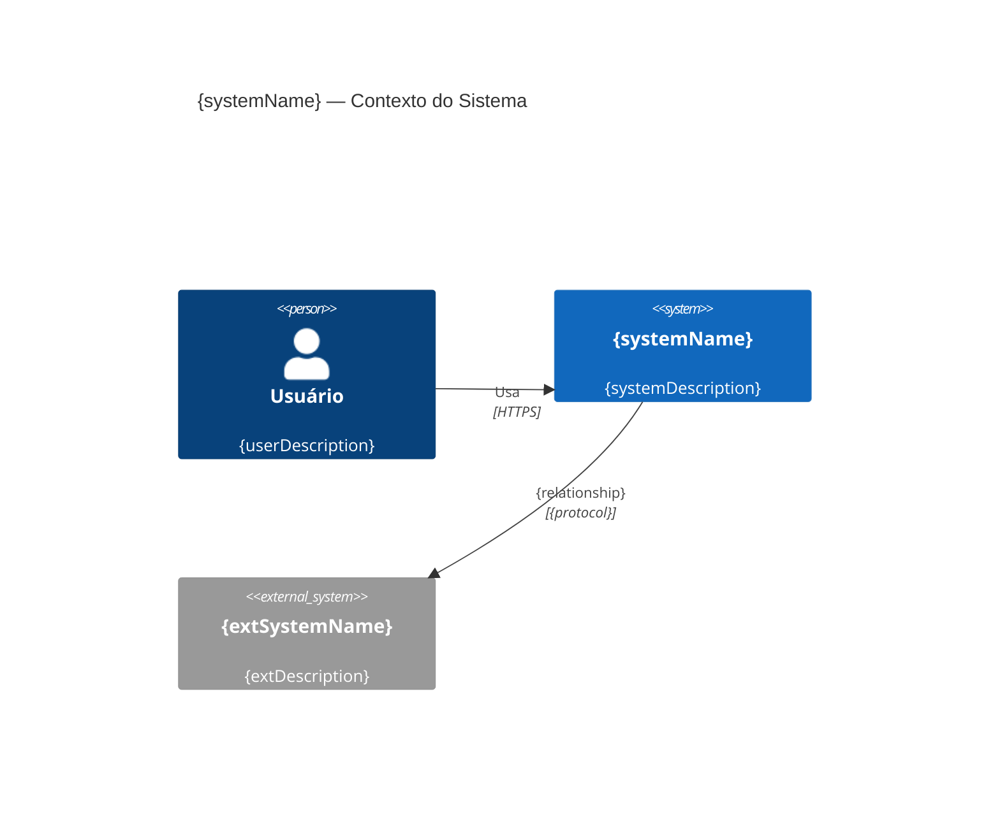
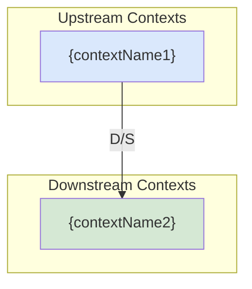

# Design: Analisador de Aplicações Legadas

## Arquitetura

```
┌──────────────────────────────────────────────────────────────┐
│                      CLI Layer                                │
│   legacy-analyzer analyze --repo ./path --output ./docs      │
└──────────────────────┬───────────────────────────────────────┘
                       │
            ┌──────────▼──────────┐
            │   AnalysisOrchestrator              │
            │   (coordena o pipeline)              │
            └──┬────────┬─────────┬──────────────┘
               │        │         │
    ┌──────────▼──┐  ┌──▼──────┐  ┌▼─────────────────┐
    │ CodeReader  │  │CodeAnaly│  │ DocGenerator      │
    │ (filesystem)│  │zer(LLM) │  │ (markdown output) │
    └─────────────┘  └─────────┘  └───────────────────┘
```

---

## Componentes Detalhados

### src/cli/index.ts
```typescript
// Commander.js
// Command: analyze
//   --repo <path>    Caminho do repositório (obrigatório)
//   --output <path>  Pasta de saída (padrão: ./docs/architecture)
//   --lang <lang>    Forçar linguagem (auto-detect por padrão)
//   --verbose        Mostrar detalhes do processo
```

### src/reader/code-reader.ts — Leitura do Repositório

```typescript
class CodeReader {
  async readRepository(repoPath: string): Promise<RepositorySnapshot>;
  // 1. Detecta framework/linguagem (FrameworkDetector)
  // 2. Lista arquivos relevantes (excluindo RF-004)
  // 3. Se > 500 arquivos: aplica estratégia de amostragem (RF-006)
  // 4. Lê conteúdo dos arquivos selecionados
  // 5. Agrupa por tipo: controllers, services, repositories, entities, other
  // 6. Retorna RepositorySnapshot
}

class FrameworkDetector {
  detect(repoPath: string): FrameworkInfo;
  // Analisa presence de arquivos marcadores (pom.xml, .csproj, package.json)
  // Analisa anotações e imports nos arquivos
}
```

### src/analyzer/code-analyzer.ts — Análise Semântica via LLM

```typescript
class CodeAnalyzer {
  async analyze(snapshot: RepositorySnapshot): Promise<AnalysisResult>;
  // Divide a análise em N chunks (máx 100KB por chunk)
  // Executa análises em paralelo (máx 3 simultâneas) via Promise.all
  // Consolida resultados

  private async analyzeChunk(chunk: CodeChunk, analysisType: AnalysisType): Promise<Partial<AnalysisResult>>;
  // Chama Claude com prompt específico por tipo:
  //   - 'services': identifica serviços e suas responsabilidades
  //   - 'use-cases': identifica operações e endpoints
  //   - 'entities': identifica entidades de domínio
  //   - 'integrations': identifica dependências externas
  //   - 'architecture': analisa padrões e débitos técnicos
}
```

### src/generator/doc-generator.ts — Geração de Documentação

```typescript
class DocGenerator {
  async generate(result: AnalysisResult, outputPath: string): Promise<void>;
  // Delega para geradores especializados:
  // C4Generator, DddContextMapGenerator, UseCaseCatalogGenerator, ArchitectureReportGenerator
  // Salva todos os arquivos + analysis-manifest.json
}

class C4Generator {
  generateContext(result: AnalysisResult): string;    // Mermaid C4Context
  generateContainers(result: AnalysisResult): string; // Mermaid C4Container
  generateComponents(result: AnalysisResult): string; // Mermaid C4Component
}

class DddContextMapGenerator {
  generate(result: AnalysisResult): string; // Mermaid flowchart com relacionamentos DDD
}

class UseCaseCatalogGenerator {
  generate(result: AnalysisResult): string; // Markdown com tabelas por domínio
}

class ArchitectureReportGenerator {
  generate(result: AnalysisResult): string; // Markdown com análise e recomendações
}
```

---

## Tipos Principais

```typescript
interface RepositorySnapshot {
  path: string;
  framework: FrameworkInfo;
  totalFiles: number;
  analyzedFiles: number;
  samplingApplied: boolean;
  fileGroups: {
    controllers: FileContent[];
    services: FileContent[];
    repositories: FileContent[];
    entities: FileContent[];
    other: FileContent[];
  };
}

interface FrameworkInfo {
  language: 'java' | 'csharp' | 'typescript' | 'python';
  framework: string; // "Spring Boot", "ASP.NET Core", "NestJS", "FastAPI", etc.
  version?: string;
}

interface FileContent {
  path: string;          // Relativo ao repo root
  content: string;
  sizeBytes: number;
}

interface AnalysisResult {
  framework: FrameworkInfo;
  services: ServiceInfo[];
  useCases: UseCaseInfo[];
  entities: EntityInfo[];
  integrations: IntegrationInfo[];
  boundedContexts: BoundedContext[];
  contextRelationships: ContextRelationship[];
  architectureStyle: string;
  patternsFound: string[];
  technicalDebts: TechnicalDebt[];
  recommendations: Recommendation[];
}

interface ServiceInfo {
  name: string;
  type: 'service' | 'controller' | 'repository' | 'manager';
  responsibilities: string[];
  sourceFile: string;
  dependencies: string[]; // outros serviços que este usa
}

interface UseCaseInfo {
  name: string;
  service: string;
  httpMethod?: 'GET' | 'POST' | 'PUT' | 'PATCH' | 'DELETE';
  path?: string;
  inputParams: string[];
  returnType: string;
  entities: string[];
  sourceFile: string;
  lineRange?: [number, number];
}

interface BoundedContext {
  name: string;
  services: string[];
  entities: string[];
  description: string;
}

interface ContextRelationship {
  from: string;
  to: string;
  pattern: 'upstream-downstream' | 'shared-kernel' | 'anti-corruption-layer' | 'open-host-service' | 'conformist';
  description: string;
}

interface TechnicalDebt {
  severity: 'CRÍTICO' | 'ALTO' | 'MÉDIO' | 'BAIXO';
  category: string; // "Ausência de abstrações", "Acoplamento excessivo", etc.
  description: string;
  sourceFiles: string[];
  recommendation: string;
}
```

---

## Prompts de Análise

### Prompt: Identificação de Serviços

```
Analise o seguinte código {framework} e identifique os serviços/componentes principais.

Para cada serviço/componente, retorne um JSON com:
- name: nome da classe/componente
- type: "service" | "controller" | "repository" | "manager"
- responsibilities: lista de responsabilidades em português
- sourceFile: caminho do arquivo
- dependencies: outros serviços/classes que este usa

Código:
{code}

Retorne APENAS JSON válido, sem explicações. Formato:
{"services": [...]}
```

### Prompt: Identificação de Use Cases

```
Analise o seguinte código {framework} e identifique todos os use cases/operações.

Para cada use case, retorne:
- name: nome descritivo da operação (verbo + substantivo)
- service: classe que contém o use case
- httpMethod: método HTTP se for endpoint (GET/POST/etc.)
- path: rota HTTP se aplicável
- inputParams: parâmetros de entrada identificados
- returnType: tipo de retorno
- entities: entidades de domínio envolvidas
- sourceFile: arquivo de origem

Código:
{code}

Retorne APENAS JSON válido. Formato:
{"useCases": [...]}
```

### Prompt: Análise de Arquitetura

```
Analise o seguinte conjunto de código {framework} e forneça uma análise arquitetural.

Identifique:
1. architectureStyle: estilo predominante (Monolito/Microsserviços/Modular Monolith/Layered/etc.)
2. patternsFound: padrões de design encontrados
3. technicalDebts: problemas encontrados com severidade (CRÍTICO/ALTO/MÉDIO/BAIXO)
4. recommendations: recomendações prioritárias

Código analisado (amostra):
{code}

Retorne APENAS JSON válido. Formato:
{
  "architectureStyle": "...",
  "patternsFound": ["..."],
  "technicalDebts": [{"severity": "...", "category": "...", "description": "...", "recommendation": "..."}],
  "recommendations": ["..."]
}
```

---

## Formato de Saída dos Diagramas

### C4 Contexto (Mermaid)

```markdown
# Diagrama C4 — Contexto do Sistema



> Gerado automaticamente por Legacy Analyzer em {timestamp}
> Fonte: análise de {analyzedFiles} arquivos em {repoPath}
```

### Mapa de Contextos DDD (Mermaid)

```markdown
# Mapa de Contextos DDD



## Relacionamentos Identificados

| De | Para | Padrão DDD | Descrição |
|----|------|-----------|-----------|
| {context1} | {context2} | Upstream/Downstream | {description} |
```

---

## Estratégia de Testes

- **Unitário:** FrameworkDetector — testa detecção por arquivos marcadores
- **Unitário:** CodeReader.sampleStrategy — testa a amostragem de arquivos grandes
- **Unitário:** cada DocGenerator — testa geração de markdown com AnalysisResult mockado
- **Integração (slow):** análise de repositório de exemplo pequeno (incluído em test/fixtures/)
- **Snapshot:** diagramas Mermaid gerados comparados com snapshots esperados
